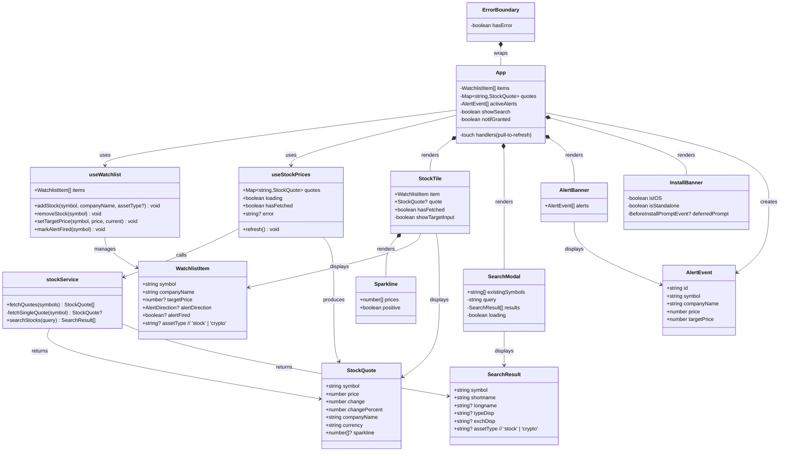
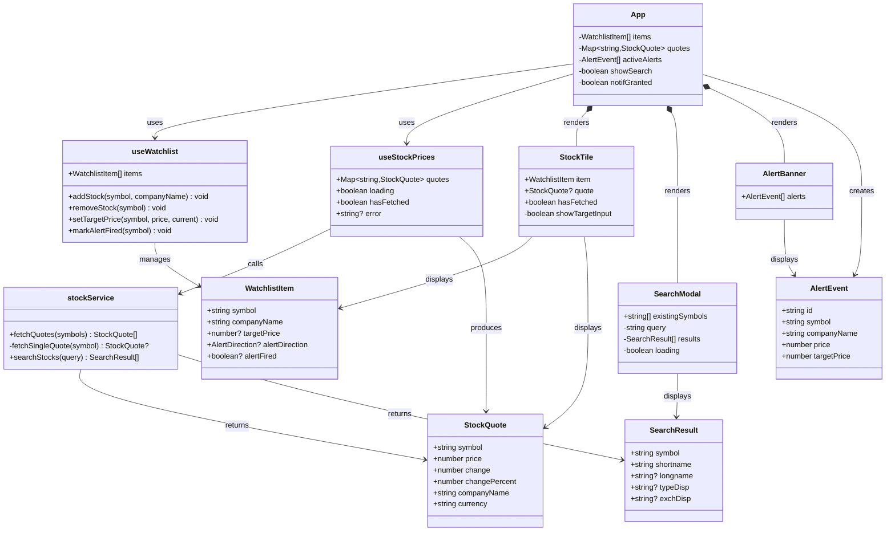

# 📈 Inwealthment — Documentation

A mobile-optimized React PWA for tracking US stocks and cryptocurrency prices in real time with target price alerts, intraday sparklines, and offline-capable installability.

---

## Table of Contents

- [Features](#features)
- [Tech Stack](#tech-stack)
- [Getting Started](#getting-started)
- [Architecture Overview](#architecture-overview)
- [File Structure](#file-structure)
- [Class & Component Diagram](#class--component-diagram)
- [Data Flow](#data-flow)
- [API & Proxy](#api--proxy)
- [State Management](#state-management)
- [Alert System](#alert-system)
- [PWA & Installability](#pwa--installability)
- [Persistence](#persistence)

---

## Features

| Feature | Details |
|---|---|
| **Watchlist tiles** | Pin stocks/crypto to a 2-column grid; each tile shows ticker, company name, live price, today's % change, and an intraday sparkline |
| **Crypto support** | Search and track cryptocurrencies (BTC-USD, ETH-USD, etc.) alongside stocks; orange CRYPTO badge on tiles |
| **Search & add** | Bottom-sheet modal with debounced search across US stocks, ETFs, indices, and cryptocurrencies via Yahoo Finance; stays open for multi-add |
| **Intraday sparkline** | SVG mini-chart of today's 5-minute price history embedded in each tile |
| **Smart price formatting** | Auto-adjusts decimal places (2 for ≥$1, 4 for sub-$1, 6 for sub-$0.0001) |
| **Color coding** | Green top-border + green % for gains, red for losses |
| **Target price alert** | Set a price target per tile; fires when the price crosses the target |
| **Browser notification** | Push notification via the Web Notifications API |
| **In-app alert banner** | Sticky banner with dismiss button |
| **Alert sound** | Beep via Web Audio API |
| **Auto-refresh** | Prices polled every 30 seconds |
| **Pull-to-refresh** | Swipe down on mobile or click the timestamp button on desktop to force refresh |
| **PWA installable** | Installable from Chrome (desktop + Android) and Safari iOS as a home screen app |
| **Offline-capable** | Service worker caches app shell via Workbox |
| **Error boundary** | Catches rendering errors and shows a fallback UI instead of a blank page |
| **Persistence** | Watchlist and targets saved to `localStorage` — no login required |
| **Mobile-first UI** | Max-width 480 px, dark theme, touch-friendly tiles |

---

## Tech Stack

| Layer | Technology |
|---|---|
| Framework | React 19 + TypeScript |
| Build tool | Vite 8 |
| PWA | vite-plugin-pwa + Workbox |
| Icons | lucide-react |
| Styling | Plain CSS with custom properties (no framework) |
| Stock data | Yahoo Finance (`v8/finance/chart`, `v1/finance/search`) |
| Dev proxy | Vite dev-server proxy (overrides `Referer`/`Origin` headers) |
| Prod proxy | Azure Functions (`api/src/functions/quote.js`) |
| Hosting | Azure Static Web Apps |
| CI/CD | GitHub Actions |
| Persistence | Browser `localStorage` |
| Notifications | Web Notifications API |
| Audio | Web Audio API |

---

## Getting Started

```bash
# Install dependencies
cd stock-tracker
npm install --legacy-peer-deps

# Start dev server (includes Yahoo Finance proxy)
npm run dev
```

Open **http://localhost:5173** in your browser.

> **Note:** In development, the Vite dev-server proxy handles Yahoo Finance requests.  
> In production (Azure), Azure Functions serve as the backend proxy.

---

## Architecture Overview

```
┌─────────────────────────────────────────────────────┐
│                      Browser                        │
│                                                     │
│  ┌──────────┐    ┌──────────────────────────────┐   │
│  │  React   │───▶│  localStorage                │   │
│  │  PWA App │    │  (watchlist + targets)        │   │
│  └────┬─────┘    └──────────────────────────────┘   │
│       │                                             │
│       │  fetch /api/quote?symbol=...                │
│       ▼                                             │
└─────────────────────────────────────────────────────┘
         │
    ┌────┴──────────────────────────────┐
    │  DEV: Vite Proxy                  │  PROD: Azure Functions
    │  vite.config.ts                   │  api/src/functions/quote.js
    └────┬──────────────────────────────┘
         │  HTTPS (Referer: finance.yahoo.com)
         ▼
┌───────────────────────────┐
│  Yahoo Finance API        │
│  query1.finance.yahoo.com │
│  /v8/finance/chart/{SYM}  │
│  interval=5m&range=1d     │
└───────────────────────────┘
```

**Deployment pipeline:**

```
git push → GitHub Actions
  └─▶ npm ci --legacy-peer-deps
  └─▶ npm run build  (Vite → dist/)
  └─▶ Azure Static Web Apps deploy
        ├─ dist/         → static hosting (CDN)
        └─ api/          → Azure Functions (Node.js)
```

---

## File Structure

```
stock-tracker/
├── index.html                      # Entry HTML; PWA meta tags, apple-touch-icon
├── vite.config.ts                  # Vite config + dev proxy + VitePWA plugin
├── public/
│   ├── icon.svg                    # App icon source (IW + chart + rocket)
│   ├── icon-192.png                # PWA manifest icon
│   ├── icon-512.png                # PWA manifest icon
│   └── apple-touch-icon.png        # iOS home screen icon
├── api/
│   └── src/functions/
│       └── quote.js                # Azure Function: proxies Yahoo Finance chart API
├── src/
│   ├── main.tsx                    # React root mount; wrapped in ErrorBoundary
│   ├── App.tsx                     # Root component — layout, alert logic, pull-to-refresh
│   ├── types.ts                    # Shared TypeScript interfaces
│   ├── index.css                   # Global CSS (dark theme, mobile-first)
│   │
│   ├── services/
│   │   └── stockService.ts         # Yahoo Finance API calls (quotes + search)
│   │
│   ├── hooks/
│   │   ├── useWatchlist.ts         # Watchlist CRUD + localStorage sync
│   │   └── useStockPrices.ts       # Price polling hook (30 s interval) + refresh
│   │
│   ├── components/
│   │   ├── StockTile.tsx           # Individual asset card (stock or crypto)
│   │   ├── Sparkline.tsx           # SVG intraday mini-chart
│   │   ├── SearchModal.tsx         # Bottom-sheet search; stays open for multi-add
│   │   ├── AlertBanner.tsx         # In-app target price alert banner
│   │   ├── InstallBanner.tsx       # PWA install guidance (iOS share / Chrome prompt)
│   │   └── ErrorBoundary.tsx       # React error boundary fallback
│   │
│   └── utils/
│       ├── audio.ts                # Web Audio API beep
│       ├── notifications.ts        # Web Notifications API helpers
│       └── formatPrice.ts          # Smart decimal formatter for prices + changes
```

---

## Class & Component Diagram



---

## Data Flow

### Loading prices on startup

```
App mounts
  └─▶ useWatchlist.loadFromStorage()       — reads localStorage
  └─▶ useStockPrices(symbols)
        └─▶ stockService.fetchQuotes()
              └─▶ GET /api/quote?symbol={SYM}  (×N in parallel)
                    DEV:  Vite proxy ──▶ query1.finance.yahoo.com
                    PROD: Azure Function ──▶ query1.finance.yahoo.com
              └─▶ extracts price, change%, sparkline (5m candles)
        └─▶ setQuotes(Map)                 — triggers re-render
  └─▶ StockTile receives quote prop        — shows price, % change, sparkline
```

### Adding an asset (stock or crypto)

```
User opens SearchModal (stays open for multi-add)
  └─▶ types query (debounced 350 ms)
  └─▶ stockService.searchStocks(query)
        └─▶ GET /api/search/v1/finance/search?q=...
        └─▶ filters: EQUITY | ETF | INDEX | CRYPTOCURRENCY
  └─▶ User taps "+" on result
  └─▶ useWatchlist.addStock(symbol, companyName, assetType)
        └─▶ saves to localStorage
  └─▶ symbols array changes → useStockPrices effect re-runs
  └─▶ new price + sparkline fetched; tile appears
  └─▶ Modal stays open — user can keep searching
  └─▶ User taps X to close modal
```

### Pull-to-refresh

```
Mobile: User pulls down (touch handlers in App.tsx)
Desktop: User clicks refresh timestamp button
  └─▶ refresh() — increments refreshKey
        └─▶ useStockPrices effect re-runs immediately
        └─▶ all quotes refetched in parallel
```

### Target price alert

```
useStockPrices polls every 30 s
  └─▶ App.useEffect watches quotes Map
        └─▶ for each WatchlistItem with a targetPrice:
              if alertDirection === 'above' && price >= target  →  HIT
              if alertDirection === 'below' && price <= target  →  HIT
        └─▶ on HIT:
              useWatchlist.markAlertFired(symbol)   — prevents re-firing
              setActiveAlerts([...prev, AlertEvent]) — shows banner
              sendNotification(title, body)          — browser push
              playAlertSound()                       — Web Audio beep
```

---

## API & Proxy

### Development
Requests go through the **Vite dev-server proxy** defined in `vite.config.ts`, which injects the required `Referer` and `Origin` headers.

### Production
Requests go through **Azure Functions** (`api/src/functions/quote.js`), which forward to Yahoo Finance with the same header overrides.

| Proxy path | Forwards to | Used for |
|---|---|---|
| `/api/quote` | `https://query1.finance.yahoo.com/v8/finance/chart/{symbol}` | Price quotes + sparkline |
| `/api/stocksearch` | `https://query2.finance.yahoo.com/v1/finance/search` | Asset search autocomplete |

### Quote endpoint

```
GET /api/quote?symbol={SYMBOL}&interval=5m&range=1d
```

Key fields used:

| Field | Source | Used as |
|---|---|---|
| `regularMarketPrice` | `meta` | Current price |
| `chartPreviousClose` | `meta` | Previous close (for change & %) |
| `shortName` / `longName` | `meta` | Company display name |
| `currency` | `meta` | Currency code |
| `close[]` | `indicators.quote[0]` | Sparkline data points (nulls filtered) |

### Search endpoint

```
GET /api/stocksearch?q={QUERY}&quotesCount=10&newsCount=0
```

Returns `quotes[]` filtered to `EQUITY`, `ETF`, `INDEX`, and `CRYPTOCURRENCY` types.

---

## State Management

There is no global state library. State is managed with React hooks and `localStorage`.

| State | Location | Persisted |
|---|---|---|
| Watchlist items + targets | `useWatchlist` (useState) | ✅ localStorage |
| Live quotes + sparklines | `useStockPrices` (useState Map) | ❌ in-memory |
| Refresh trigger | `useStockPrices` (refreshKey counter) | ❌ in-memory |
| Active alert banners | `App` (useState array) | ❌ in-memory |
| Search results | `SearchModal` (useState) | ❌ in-memory |
| Notification permission | `App` (useState boolean) | browser-managed |
| PWA install prompt | `InstallBanner` (useState) | sessionStorage (dismissed flag) |

---

## Alert System

When the user sets a **target price** on a tile:

1. The current price is compared to the target to determine **direction**:
   - `above` — alert when price rises **to or above** the target
   - `below` — alert when price falls **to or below** the target
2. On every 30-second poll, `App` checks all items with an active `alertDirection`
3. When the condition is met the alert fires **once** (`alertFired = true`, `alertDirection` cleared) — it will not repeat until the user sets a new target
4. Three simultaneous notifications are sent:
   - 🔔 **Browser push notification** (requires permission)
   - 🟠 **In-app sticky banner** (always shown, dismissible)
   - 🔊 **Audio beep** via Web Audio API (880 Hz → 440 Hz tone)

---

## PWA & Installability

The app is configured as a **Progressive Web App** using `vite-plugin-pwa` (Workbox).

| Platform | Install method |
|---|---|
| Chrome (desktop/Android) | Click install button in `InstallBanner` or browser address bar icon |
| Safari iOS | Tap Share → Add to Home Screen |

- `registerType: 'autoUpdate'` — service worker silently updates on new deployment
- `display: 'standalone'` — hides browser chrome when launched from home screen
- `InstallBanner` detects platform via `navigator.standalone` and `beforeinstallprompt` event; auto-hides when already running in standalone mode
- Icons: `icon-192.png`, `icon-512.png` (manifest), `apple-touch-icon.png` (iOS)

---

## Persistence

The watchlist is stored in `localStorage` under the key `inwealthment-watchlist` as a JSON array of `WatchlistItem` objects.

```json
[
  {
    "symbol": "AAPL",
    "companyName": "Apple Inc.",
    "targetPrice": 280,
    "alertDirection": "above",
    "alertFired": false,
    "assetType": "stock"
  },
  {
    "symbol": "BTC-USD",
    "companyName": "Bitcoin USD",
    "targetPrice": null,
    "alertDirection": null,
    "alertFired": false,
    "assetType": "crypto"
  }
]
```

Live prices and sparklines are **not** persisted — they are always fetched fresh on app load.


---

## Table of Contents

- [Features](#features)
- [Tech Stack](#tech-stack)
- [Getting Started](#getting-started)
- [Architecture Overview](#architecture-overview)
- [File Structure](#file-structure)
- [Class & Component Diagram](#class--component-diagram)
- [Data Flow](#data-flow)
- [API & Proxy](#api--proxy)
- [State Management](#state-management)
- [Alert System](#alert-system)
- [Persistence](#persistence)

---

## Features

| Feature | Details |
|---|---|
| **Watchlist tiles** | Pin stocks to a 2-column grid; each tile shows ticker, company name, live price, and today's % change |
| **Search & add** | Bottom-sheet modal with debounced search across all US stocks and ETFs via Yahoo Finance |
| **Color coding** | Green top-border + green % for gains, red for losses |
| **Target price alert** | Set a price target per tile; fires when the price crosses the target |
| **Browser notification** | Push notification via the Web Notifications API |
| **In-app alert banner** | Sticky banner with dismiss button |
| **Alert sound** | Beep via Web Audio API |
| **Auto-refresh** | Prices polled every 30 seconds |
| **Persistence** | Watchlist and targets saved to `localStorage` — no login required |
| **Mobile-first UI** | Max-width 480 px, dark theme, touch-friendly tiles |

---

## Tech Stack

| Layer | Technology |
|---|---|
| Framework | React 19 + TypeScript |
| Build tool | Vite 8 |
| Icons | lucide-react |
| Styling | Plain CSS with custom properties (no framework) |
| Stock data | Yahoo Finance (`v8/finance/chart`, `v1/finance/search`) |
| CORS proxy | Vite dev-server proxy (overrides `Referer`/`Origin` headers) |
| Persistence | Browser `localStorage` |
| Notifications | Web Notifications API |
| Audio | Web Audio API |

---

## Getting Started

```bash
# Install dependencies
cd stock-tracker
npm install

# Start dev server (includes Yahoo Finance proxy)
npm run dev
```

Open **http://localhost:5173** in your browser.

> **Note:** The Yahoo Finance proxy only works while the Vite dev server is running.  
> For production you would need a small backend proxy (e.g. Express or a serverless function).

---

## Architecture Overview

The app is a **single-page React application** with no backend. All data is fetched client-side through the Vite dev-server proxy, which forwards requests to Yahoo Finance with the correct headers to avoid being blocked.

```
┌─────────────────────────────────────────────┐
│                  Browser                    │
│                                             │
│  ┌──────────┐    ┌──────────────────────┐   │
│  │  React   │───▶│    localStorage      │   │
│  │   App    │    │  (watchlist + targets│   │
│  └────┬─────┘    └──────────────────────┘   │
│       │                                     │
│       │  fetch /api/yahoo/...               │
│       ▼                                     │
│  ┌──────────┐                               │
│  │  Vite    │                               │
│  │  Proxy   │                               │
│  └────┬─────┘                               │
└───────┼─────────────────────────────────────┘
        │  HTTPS  (Referer: finance.yahoo.com)
        ▼
┌───────────────────────┐
│  query1.finance.      │
│  yahoo.com            │
│  /v8/finance/chart/   │
│  {SYMBOL}             │
└───────────────────────┘
```

---

## File Structure

```
stock-tracker/
├── index.html                  # Entry HTML, sets viewport & theme-color
├── vite.config.ts              # Vite config + Yahoo Finance proxy rules
├── src/
│   ├── main.tsx                # React root mount
│   ├── App.tsx                 # Root component — layout, alert logic
│   ├── types.ts                # Shared TypeScript interfaces
│   ├── index.css               # Global CSS (dark theme, mobile-first)
│   │
│   ├── services/
│   │   └── stockService.ts     # Yahoo Finance API calls
│   │
│   ├── hooks/
│   │   ├── useWatchlist.ts     # Watchlist CRUD + localStorage sync
│   │   └── useStockPrices.ts   # Price polling hook (30 s interval)
│   │
│   ├── components/
│   │   ├── StockTile.tsx       # Individual stock card
│   │   ├── SearchModal.tsx     # Bottom-sheet stock search
│   │   └── AlertBanner.tsx     # In-app target price alert banner
│   │
│   └── utils/
│       ├── audio.ts            # Web Audio API beep
│       └── notifications.ts    # Web Notifications API helpers
```

---

## Class & Component Diagram



---

## Data Flow

### Loading prices on startup

```
App mounts
  └─▶ useWatchlist.loadFromStorage()       — reads localStorage
  └─▶ useStockPrices(symbols)
        └─▶ stockService.fetchQuotes()
              └─▶ GET /api/yahoo/v8/finance/chart/{symbol}  (×N in parallel)
                    └─▶ Vite proxy ──▶ query1.finance.yahoo.com
        └─▶ setQuotes(Map)                 — triggers re-render
  └─▶ StockTile receives quote prop        — shows price & % change
```

### Adding a stock

```
User opens SearchModal
  └─▶ types query (debounced 350 ms)
  └─▶ stockService.searchStocks(query)
        └─▶ GET /api/search/v1/finance/search?q=...
  └─▶ User taps result
  └─▶ useWatchlist.addStock(symbol, companyName)
        └─▶ saves to localStorage
  └─▶ symbols array changes → useStockPrices effect re-runs
  └─▶ new price fetched and tile appears
```

### Target price alert

```
useStockPrices polls every 30 s
  └─▶ App.useEffect watches quotes Map
        └─▶ for each WatchlistItem with a targetPrice:
              if alertDirection === 'above' && price >= target  →  HIT
              if alertDirection === 'below' && price <= target  →  HIT
        └─▶ on HIT:
              useWatchlist.markAlertFired(symbol)   — prevents re-firing
              setActiveAlerts([...prev, AlertEvent]) — shows banner
              sendNotification(title, body)          — browser push
              playAlertSound()                       — Web Audio beep
```

---

## API & Proxy

All requests go through the **Vite dev-server proxy** defined in `vite.config.ts`, which adds the required `Referer` and `Origin` headers so Yahoo Finance accepts the requests.

| Proxy path | Forwards to | Used for |
|---|---|---|
| `/api/yahoo/*` | `https://query1.finance.yahoo.com` | Price quotes |
| `/api/search/*` | `https://query2.finance.yahoo.com` | Stock search autocomplete |

### Quote endpoint

```
GET /api/yahoo/v8/finance/chart/{SYMBOL}?interval=1d&range=1d
```

Key fields used from `chart.result[0].meta`:

| Field | Used as |
|---|---|
| `regularMarketPrice` | Current price |
| `chartPreviousClose` | Previous close (to compute change & %) |
| `shortName` / `longName` | Company display name |
| `currency` | Currency code (USD) |

### Search endpoint

```
GET /api/search/v1/finance/search?q={QUERY}&quotesCount=10&newsCount=0
```

Returns `quotes[]` filtered to `EQUITY`, `ETF`, and `INDEX` types.

---

## State Management

There is no global state library. State is managed with React hooks and `localStorage`.

| State | Location | Persisted |
|---|---|---|
| Watchlist items + targets | `useWatchlist` (useState) | ✅ localStorage |
| Live quotes | `useStockPrices` (useState Map) | ❌ in-memory |
| Active alert banners | `App` (useState array) | ❌ in-memory |
| Search results | `SearchModal` (useState) | ❌ in-memory |
| Notification permission | `App` (useState boolean) | browser-managed |

---

## Alert System

When the user sets a **target price** on a tile:

1. The current price is compared to the target to determine **direction**:
   - `above` — alert when price rises **to or above** the target
   - `below` — alert when price falls **to or below** the target
2. On every 30-second poll, `App` checks all items with an active `alertDirection`
3. When the condition is met the alert fires **once** (`alertFired = true`, `alertDirection` cleared) — it will not repeat until the user sets a new target
4. Three simultaneous notifications are sent:
   - 🔔 **Browser push notification** (requires permission)
   - 🟠 **In-app sticky banner** (always shown, dismissible)
   - 🔊 **Audio beep** via Web Audio API (880 Hz → 440 Hz tone)

---

## Persistence

The watchlist is stored in `localStorage` under the key `inwealthment-watchlist` as a JSON array of `WatchlistItem` objects.

```json
[
  {
    "symbol": "AAPL",
    "companyName": "Apple Inc.",
    "targetPrice": 280,
    "alertDirection": "above",
    "alertFired": false
  }
]
```

Live prices are **not** persisted — they are always fetched fresh on app load.
