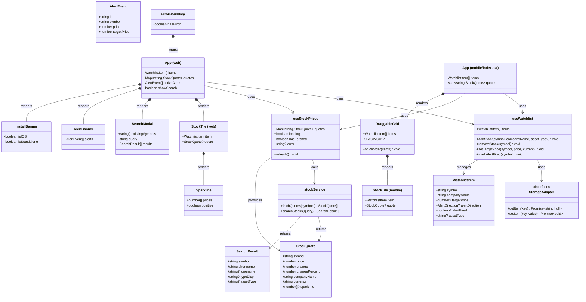

# 📈 Inwealthment — Architecture

A monorepo containing a React 19 PWA for the web and an Expo SDK 53 native iOS app, both sharing TypeScript hooks and types.

---

## Table of Contents

1. [Features](#features)
2. [Tech Stack](#tech-stack)
3. [Monorepo Structure](#monorepo-structure)
4. [Getting Started](#getting-started)
5. [Architecture Overview](#architecture-overview)
6. [File Structure](#file-structure)
7. [Shared Package](#shared-package)
8. [Component Diagram](#component-diagram)
9. [Data Flow](#data-flow)
10. [API & Proxy](#api--proxy)
11. [State Management](#state-management)
12. [Alert System](#alert-system)
13. [PWA & Installability](#pwa--installability)
14. [Native iOS](#native-ios)
15. [Drag-to-Reorder Grid](#drag-to-reorder-grid)
16. [Persistence](#persistence)

---

## Features

| Feature | Web | Mobile |
|---|---|---|
| **Watchlist tiles** — ticker, price, % change, sparkline | ✅ | ✅ |
| **Crypto support** — BTC-USD, ETH-USD, etc. with CRYPTO badge | ✅ | ✅ |
| **Search & add** — debounced Yahoo Finance search | ✅ bottom-sheet modal | ✅ |
| **Intraday sparkline** — SVG 5-minute mini-chart | ✅ | ✅ |
| **Smart price formatting** — 2/4/6 decimal places | ✅ | ✅ |
| **Color coding** — green/red borders + % text | ✅ | ✅ |
| **Target price alert** — fires when price crosses target | ✅ | ✅ |
| **Browser notification** — Web Notifications API | ✅ web-only | ❌ |
| **In-app alert banner** — sticky dismissible banner | ✅ | ✅ |
| **Alert sound** — Web Audio API beep | ✅ web-only | ❌ |
| **Auto-refresh** — prices polled every 30 seconds | ✅ | ✅ |
| **Pull-to-refresh** — swipe down or tap timestamp | ✅ | ✅ |
| **Drag-to-reorder** — long-press tile and drag | ❌ | ✅ mobile-only |
| **PWA installable** — Chrome + Safari iOS | ✅ web-only | ❌ |
| **Offline-capable** — Workbox service worker cache | ✅ web-only | ❌ |
| **Error boundary** — catch render errors, show fallback | ✅ | ❌ |
| **Persistence** — watchlist + targets saved locally | localStorage | AsyncStorage |
| **Mobile-first UI** — dark theme, touch-friendly | ✅ | ✅ |

---

## Tech Stack

| Layer | Web | Mobile | Shared |
|---|---|---|---|
| Language | TypeScript | TypeScript | TypeScript |
| Framework | React 19 | React Native (Expo SDK 53) | — |
| Build tool | Vite 8 | Metro bundler | — |
| Routing | Single page | Expo Router (file-based) | — |
| PWA | vite-plugin-pwa + Workbox | — | — |
| Navigation/Gesture | — | RNGH + Reanimated | — |
| Icons | lucide-react | — | — |
| Styling | Plain CSS + custom properties | StyleSheet.create | — |
| Storage | localStorage | AsyncStorage | StorageAdapter interface |
| Stock data | Yahoo Finance | Yahoo Finance | stockService |
| Dev proxy | Vite dev-server proxy | — | — |
| Prod proxy | Azure Functions | Azure Functions | — |
| Hosting | Azure Static Web Apps | Device / TestFlight | — |
| CI/CD | GitHub Actions | GitHub Actions | — |
| Notifications | Web Notifications API | — | — |
| Audio | Web Audio API | — | — |

---

## Monorepo Structure

The repo uses **npm workspaces** declared in the root `package.json`:

```json
{
  "workspaces": ["packages/*"]
}
```

| Package | Path | Role |
|---|---|---|
| `@inwealthment/web` | `packages/web` | React 19 + Vite 8 PWA |
| `@inwealthment/mobile` | `packages/mobile` | Expo SDK 53 iOS native app |
| `@inwealthment/shared` | `packages/shared` | Shared hooks, types, StorageAdapter |

`packages/web` and `packages/mobile` both declare `"@inwealthment/shared": "*"` as a dependency. npm workspaces resolve this to the local `packages/shared` directory — no publishing required.

---

## Getting Started

```bash
# Install all workspace dependencies from repo root
npm install --legacy-peer-deps

# Start web dev server (localhost:5173, includes Yahoo Finance proxy)
cd packages/web
npx vite --host 0.0.0.0 --port 5173

# Start mobile dev server (Expo, port 8081)
cd packages/mobile
npx expo start --port 8081
```

> **Web:** Open **http://localhost:5173** in your browser.  
> **Mobile:** The Expo dev client shows a QR code. For physical device builds, see [Native iOS](#native-ios).

---

## Architecture Overview

```
┌──────────────────────────┐    ┌──────────────────────────┐
│       packages/web       │    │     packages/mobile      │
│   React 19 + Vite PWA   │    │   Expo SDK 53 + RN iOS   │
│                          │    │                          │
│  localStorage adapter    │    │  AsyncStorage adapter    │
└────────────┬─────────────┘    └────────────┬─────────────┘
             │                               │
             └──────────────┬────────────────┘
                            │
             ┌──────────────▼─────────────────┐
             │        packages/shared          │
             │  useWatchlist  useStockPrices   │
             │  StorageAdapter  types.ts        │
             └──────────────┬─────────────────┘
                            │
             ┌──────────────▼─────────────────┐
             │  DEV:  Vite proxy               │
             │  PROD: Azure Functions          │
             └──────────────┬─────────────────┘
                            │  HTTPS
                            ▼
             ┌──────────────────────────────────┐
             │    Yahoo Finance API              │
             │  query1.finance.yahoo.com         │
             │  /v8/finance/chart/{SYM}          │
             │  /v1/finance/search               │
             └──────────────────────────────────┘
```

**Deployment pipeline:**

```
git push → GitHub Actions
  └─▶ npm ci --legacy-peer-deps
  └─▶ npm run build  (Vite → packages/web/dist/)
  └─▶ Azure Static Web Apps deploy
        ├─ dist/  → static hosting (CDN)
        └─ api/   → Azure Functions (Node.js)
```

---

## File Structure

```
stock-tracker/                          # repo root (npm workspaces)
├── package.json                        # workspaces: ["packages/*"]
├── package-lock.json
├── ARCHITECTURE.md
├── LEARNING.md
│
└── packages/
    ├── shared/                         # @inwealthment/shared
    │   ├── package.json
    │   └── src/
    │       ├── types.ts                # WatchlistItem, StockQuote, SearchResult, AlertEvent
    │       ├── storage.ts              # StorageAdapter interface
    │       ├── hooks/
    │       │   ├── useWatchlist.ts     # Watchlist CRUD (platform-agnostic)
    │       │   └── useStockPrices.ts   # Price polling hook (30 s interval)
    │       └── index.ts                # barrel exports
    │
    ├── web/                            # @inwealthment/web
    │   ├── package.json
    │   ├── index.html                  # PWA meta tags, apple-touch-icon
    │   ├── vite.config.ts              # Vite config + dev proxy + VitePWA plugin
    │   ├── public/
    │   │   ├── icon-192.png            # PWA manifest icon
    │   │   ├── icon-512.png            # PWA manifest icon
    │   │   └── apple-touch-icon.png    # iOS home screen icon
    │   ├── api/
    │   │   └── src/functions/
    │   │       └── quote.js            # Azure Function: proxies Yahoo Finance
    │   └── src/
    │       ├── main.tsx                # React root mount; wrapped in ErrorBoundary
    │       ├── App.tsx                 # Root component — layout, alert logic
    │       ├── index.css               # Global CSS (dark theme, mobile-first)
    │       ├── services/
    │       │   └── stockService.ts     # Yahoo Finance API calls
    │       └── components/
    │           ├── StockTile.tsx       # Asset card (stock or crypto)
    │           ├── Sparkline.tsx       # SVG intraday mini-chart
    │           ├── SearchModal.tsx     # Bottom-sheet search; multi-add
    │           ├── AlertBanner.tsx     # In-app target price alert banner
    │           ├── InstallBanner.tsx   # PWA install guidance
    │           └── ErrorBoundary.tsx   # React error boundary fallback
    │
    └── mobile/                         # @inwealthment/mobile
        ├── package.json
        ├── app.json                    # Expo config (bundle ID, team, etc.)
        ├── metro.config.js             # disableHierarchicalLookup: true
        ├── ios/
        │   └── Podfile                 # fmt/Xcode 26 patch in post_install
        └── src/
            ├── app/                    # Expo Router (file-based routing)
            │   ├── _layout.tsx         # Root layout; GestureHandlerRootView
            │   └── index.tsx           # Home screen
            └── components/
                ├── StockTile.tsx       # Native asset card
                └── DraggableGrid.tsx   # Drag-to-reorder 2-column grid
```

---

## Shared Package

### StorageAdapter interface

`packages/shared/src/storage.ts` defines a minimal interface:

```typescript
export interface StorageAdapter {
  getItem(key: string): Promise<string | null>;
  setItem(key: string, value: string): Promise<void>;
}
```

Web implementation (wraps `localStorage`):
```typescript
export const localStorageAdapter: StorageAdapter = {
  getItem: async (key) => localStorage.getItem(key),
  setItem: async (key, value) => localStorage.setItem(key, value),
};
```

Mobile implementation (wraps `AsyncStorage`):
```typescript
import AsyncStorage from '@react-native-async-storage/async-storage';
export const asyncStorageAdapter: StorageAdapter = {
  getItem: (key) => AsyncStorage.getItem(key),
  setItem: (key, value) => AsyncStorage.setItem(key, value),
};
```

### Shared hooks

| Hook | File | Purpose |
|---|---|---|
| `useWatchlist` | `hooks/useWatchlist.ts` | Watchlist CRUD; accepts a `StorageAdapter` |
| `useStockPrices` | `hooks/useStockPrices.ts` | Price polling; 30-second interval |

### Shared types

Defined in `packages/shared/src/types.ts`:

| Type | Fields |
|---|---|
| `WatchlistItem` | `symbol`, `companyName`, `targetPrice?`, `alertDirection?`, `alertFired?`, `assetType?` |
| `StockQuote` | `symbol`, `price`, `change`, `changePercent`, `companyName`, `currency`, `sparkline?` |
| `SearchResult` | `symbol`, `shortname`, `longname?`, `typeDisp?`, `exchDisp?`, `assetType?` |
| `AlertEvent` | `id`, `symbol`, `companyName`, `price`, `targetPrice` |

---

## Component Diagram



---

## Data Flow

### Loading prices on startup

```
App mounts
  └─▶ useWatchlist.loadFromStorage()    — reads localStorage / AsyncStorage
  └─▶ useStockPrices(symbols)
        └─▶ stockService.fetchQuotes()
              └─▶ GET /api/quote?symbol={SYM}  (×N in parallel)
                    DEV:  Vite proxy ──▶ query1.finance.yahoo.com
                    PROD: Azure Function ──▶ query1.finance.yahoo.com
              └─▶ extracts price, change%, sparkline (5m candles)
        └─▶ setQuotes(Map)              — triggers re-render
  └─▶ StockTile receives quote prop     — shows price, % change, sparkline
```

### Adding an asset (stock or crypto)

```
User opens SearchModal (stays open for multi-add)
  └─▶ types query (debounced 350 ms)
  └─▶ stockService.searchStocks(query)
        └─▶ GET /api/stocksearch?q=...
        └─▶ filters: EQUITY | ETF | INDEX | CRYPTOCURRENCY
  └─▶ User taps "+" on result
  └─▶ useWatchlist.addStock(symbol, companyName, assetType)
        └─▶ saves to storage via StorageAdapter
  └─▶ symbols array changes → useStockPrices effect re-runs
  └─▶ new price + sparkline fetched; tile appears
```

### Reordering tiles (mobile only)

```
User long-presses tile (300 ms) → drag activates
  └─▶ DraggableGrid tracks position with useSharedValue
  └─▶ Reanimated computes translated position on UI thread
        transform: [translateX, translateY]  ← not left/top
  └─▶ On release: grid recalculates logical order
  └─▶ onReorder(newItems) → useWatchlist updates + persists
```

### Target price alert

```
useStockPrices polls every 30 s
  └─▶ App.useEffect watches quotes Map
        └─▶ for each WatchlistItem with a targetPrice:
              if alertDirection === 'above' && price >= target  →  HIT
              if alertDirection === 'below' && price <= target  →  HIT
        └─▶ on HIT:
              useWatchlist.markAlertFired(symbol)    — prevents re-firing
              setActiveAlerts([...prev, AlertEvent]) — shows banner
              sendNotification(title, body)           — browser push (web)
              playAlertSound()                        — Web Audio beep (web)
```

---

## API & Proxy

### Development
Requests go through the **Vite dev-server proxy** defined in `packages/web/vite.config.ts`, which injects the required `Referer` and `Origin` headers.

### Production
Requests go through **Azure Functions** (`api/src/functions/quote.js`), which forward to Yahoo Finance with the same header overrides.

| Proxy path | Forwards to | Used for |
|---|---|---|
| `/api/quote` | `https://query1.finance.yahoo.com/v8/finance/chart/{symbol}` | Price quotes + sparkline |
| `/api/stocksearch` | `https://query2.finance.yahoo.com/v1/finance/search` | Asset search autocomplete |

### Quote endpoint

```
GET /api/quote?symbol={SYMBOL}&interval=5m&range=1d
```

| Field | Source | Used as |
|---|---|---|
| `regularMarketPrice` | `meta` | Current price |
| `chartPreviousClose` | `meta` | Previous close (for change & %) |
| `shortName` / `longName` | `meta` | Company display name |
| `currency` | `meta` | Currency code |
| `close[]` | `indicators.quote[0]` | Sparkline data points (nulls filtered) |

### Search endpoint

```
GET /api/stocksearch?q={QUERY}&quotesCount=10&newsCount=0
```

Returns `quotes[]` filtered to `EQUITY`, `ETF`, `INDEX`, and `CRYPTOCURRENCY` types.

---

## State Management

No global state library. State is managed with React hooks and platform storage via `StorageAdapter`.

| State | Location | Persisted | Platforms |
|---|---|---|---|
| Watchlist items + targets | `useWatchlist` (useState) | ✅ via StorageAdapter | Both |
| Live quotes + sparklines | `useStockPrices` (useState Map) | ❌ in-memory | Both |
| Refresh trigger | `useStockPrices` (refreshKey) | ❌ in-memory | Both |
| Active alert banners | `App` (useState array) | ❌ in-memory | Both |
| Search results | `SearchModal` (useState) | ❌ in-memory | Both |
| Notification permission | `App` (useState boolean) | browser-managed | Web only |
| PWA install prompt | `InstallBanner` (useState) | sessionStorage | Web only |

---

## Alert System

When the user sets a **target price** on a tile:

1. The current price is compared to the target to determine **direction**:
   - `above` — alert when price rises **to or above** the target
   - `below` — alert when price falls **to or below** the target
2. On every 30-second poll, `App` checks all items with an active `alertDirection`
3. When the condition is met the alert fires **once** (`alertFired = true`, `alertDirection` cleared) — it will not repeat until the user sets a new target
4. Three simultaneous notifications:
   - 🔔 **Browser push notification** (requires permission) — web only
   - 🟠 **In-app sticky banner** (always shown, dismissible) — both platforms
   - 🔊 **Audio beep** via Web Audio API (880 Hz → 440 Hz tone) — web only

---

## PWA & Installability

The web app is configured as a **Progressive Web App** using `vite-plugin-pwa` (Workbox).

| Platform | Install method |
|---|---|
| Chrome (desktop/Android) | Click install button in `InstallBanner` or browser address bar icon |
| Safari iOS | Tap Share → Add to Home Screen |

- `registerType: 'autoUpdate'` — service worker silently updates on new deployment
- `display: 'standalone'` — hides browser chrome when launched from home screen
- `InstallBanner` detects platform via `navigator.standalone` and `beforeinstallprompt` event; auto-hides when already running in standalone mode
- Icons: `icon-192.png`, `icon-512.png` (manifest), `apple-touch-icon.png` (iOS)

---

## Native iOS

The mobile app is built with **Expo SDK 53** on top of React Native.

| Detail | Value |
|---|---|
| SDK | Expo SDK 53 |
| Bundler | Metro (`disableHierarchicalLookup: true` for monorepo deduplication) |
| Routing | Expo Router (file-based, like Next.js for native) |
| Bundle ID | `com.abohoseini.inwealthment` |
| Team | `Y836Z4K5J8` |
| Build | Local Xcode build (not EAS) |

**Expo Router file layout:**

| File | Purpose |
|---|---|
| `app/_layout.tsx` | Root layout; wraps everything in `GestureHandlerRootView` |
| `app/index.tsx` | Home screen (watchlist grid) |

**Physical device testing:**

```bash
xcrun devicectl device process launch --device 00008140-001A0DD82242801C
```

**iOS Podfile patch** (`packages/mobile/ios/Podfile` `post_install` hook):  
Applies the fmt/Xcode 26 compatibility fix required for modern Xcode versions.

**Metro monorepo config** (`metro.config.js`):
```js
config.resolver.disableHierarchicalLookup = true;
```
This ensures React is not duplicated between `packages/shared` and `packages/mobile`.

---

## Drag-to-Reorder Grid

`packages/mobile/src/components/DraggableGrid.tsx` implements a 2-column draggable grid using **React Native Gesture Handler** and **Reanimated**.

### Layout

- 2 columns, uniform `SPACING = 12` gap between tiles
- Tile width = `(screenWidth - SPACING * 3) / 2`
- An always-on **height probe** measures actual tile height before the grid renders to avoid layout jumps

### Gesture

```
Long-press (300 ms) → drag activates
  └─▶ Pan gesture tracks (translationX, translationY)
  └─▶ useSharedValue<{x, y}> offsets updated on UI thread
  └─▶ useAnimatedStyle applies transform: [translateX, translateY]
        ← NOT left/top (which would trigger Yoga re-layout)
  └─▶ On release: logical position mapped back to grid index
  └─▶ onReorder callback fires with reordered WatchlistItem[]
```

### Why `transform` not `left`/`top`

Setting `left`/`top` causes Yoga (React Native's layout engine) to re-measure sibling elements on every frame — expensive and janky. `transform: [translateX, translateY]` bypasses Yoga entirely and composites on the GPU, keeping animations at 60 fps.

### Key APIs

| API | Purpose |
|---|---|
| `useSharedValue` | Shared state between JS and UI threads |
| `useAnimatedStyle` | Computes styles on the UI thread |
| `withSpring` | Spring-based animation on release |
| `'worklet'` directive | Marks a function to run on the UI thread |
| `Gesture.Pan().activateAfterLongPress(300)` | Long-press-then-drag pattern |
| `GestureDetector` | Attaches gesture to a component |
| `GestureHandlerRootView` | Required root wrapper (in `_layout.tsx`) |

---

## Persistence

The watchlist is stored under the key `inwealthment-watchlist` as a JSON array of `WatchlistItem` objects.

| Platform | Storage | Adapter |
|---|---|---|
| Web | `localStorage` | `localStorageAdapter` |
| Mobile | `AsyncStorage` | `asyncStorageAdapter` |

Both adapters satisfy the `StorageAdapter` interface (`getItem`/`setItem`). The `useWatchlist` hook is completely platform-agnostic — it only calls `adapter.getItem()` and `adapter.setItem()`, never touching platform APIs directly.

**Stored format:**

```json
[
  {
    "symbol": "AAPL",
    "companyName": "Apple Inc.",
    "targetPrice": 280,
    "alertDirection": "above",
    "alertFired": false,
    "assetType": "stock"
  },
  {
    "symbol": "BTC-USD",
    "companyName": "Bitcoin USD",
    "targetPrice": null,
    "alertDirection": null,
    "alertFired": false,
    "assetType": "crypto"
  }
]
```

Live prices and sparklines are **not** persisted — they are always fetched fresh on app load.
